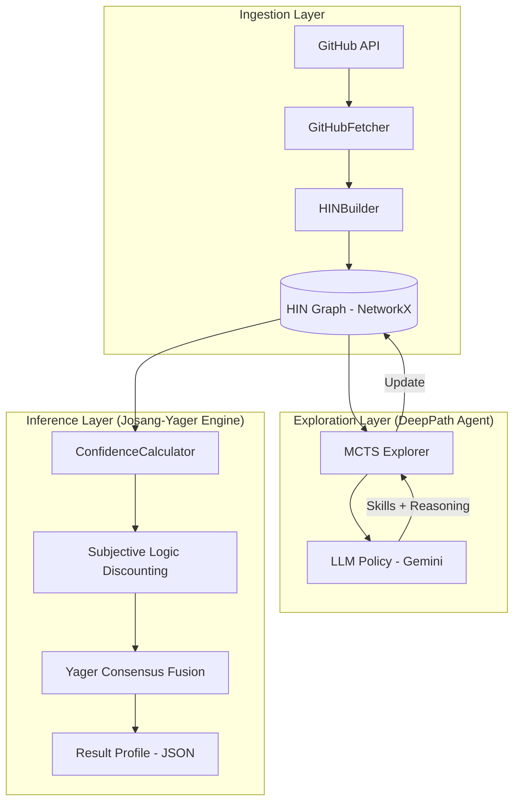

# System Architecture: Skill Inference Information Network (SIIN)

This document provides a technical deep-dive into the SIIN architecture, a graph-theoretic system for inferring technical expertise from developer activity.

## 1. High-Level Architecture
The system follows a three-layer pipeline: **Ingestion**, **Exploration**, and **Inference**.

---

## 2. Component Specifications

### 2.1 Ingestion Layer (HINBuilder)
- **Node Types**: Developer ($D$), Repository ($P$), Commit ($C$), File ($F$), Skill ($S$), Issue ($I$).
- **Weighting Strategy**: 
    - **TF-IDF Semantic Filtering**: Normalizes code diffs to prioritize unique technical keywords over boilerplate.
    - **Visibility Indices**: Calculates $Vis(D)$ based on commit volume and interaction frequency.

### 2.2 Exploration Layer (DeepPath MCTS)
- **State Space**: Path-aware vectors $[e_{current}, e_{target}, \vec{B}]$.
- **Policy Network**: LLM-guided PUCT search.
- **Reward Function ($R_{total}$)**:
    - $R_{acc}$: LLM semantic confidence.
    - $R_{eff}$: Path length penalty ($1/L^2$).
    - $R_{div}$: Diversity bonus for unexplored meta-path types.
- **Reasoner**: Chain-of-Thought (CoT) simulation to establish causal links between code and skills.

### 2.3 Inference Layer (Josang-Yager Hybrid)
- **Model**: Subjective Logic Opinions $\omega = (b, d, u, a)$.
- **Trust Propagation**: Recursive Discounting ($\otimes$) along graph paths.
- **Evidence Fusion**: Yager's Rule of Combination. Reallocates conflict $K$ to uncertainty $u$ to prevent artificial certainty.
- **Normalization**: Base-rate grounded popularity-penalization for generic skills (Git, Python).

---

## 3. Data Flow
1. **GitHubFetcher** retrieves `MAX_REPOS` repositories (default: 30) including metadata (stars, languages, topics).
2. **HINBuilder** constructs the topology and calculates TF-IDF across the commit corpus.
3. **MCTSAgent** runs `iterations` (default: 20) of deep search. In each iter, LLM creates virtual "Skill" nodes and "Implies" edges.
4. **ConfidenceCalculator** walks the augmented graph, finds evidence paths, and fuses them into the final profile.

## 4. Scalability & Deployment
- **Backend**: Python 3.12 (FastAPI).
- **Frontend**: React + Tailwind + Lucide Icons.
- **Storage**: `.gpickle` for Graph objects, `.json` for profiles.
- **Auth**: [WIP] Integrated GitHub OAuth for secure user-specific profiling.
